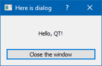

### Простейшее GUI-приложение

В командной строке выполняем

```
md HelloGui
cd HelloGui
qtvars
```

Создаем `HelloGui.pro`

```
TEMPLATE = app

QT += core gui widgets

SOURCES = HelloGui.cpp
```

и `HelloGui.cpp`

```cpp
#include <QApplication>
#include <QDialog>
#include <QLabel>
#include <QLayout>
#include <QPushButton>

int main(int argc, char *argv[])
{
    QApplication app(argc, argv);
    QDialog *dialog = new QDialog();
    dialog->setWindowTitle ("Here is dialog");
    dialog->resize(200, 100);
    QVBoxLayout *layout = new QVBoxLayout(dialog);
    QLabel *label = new QLabel(dialog);
    layout->addWidget(label);
    label->setText("Hello, QT!");
    label->setAlignment(Qt::AlignCenter | Qt::AlignHCenter);
    QPushButton *button = new QPushButton(dialog);
    layout->addWidget(button);
    button->setText("Close the window");
    dialog->connect(button,SIGNAL(clicked()),
                    dialog, SLOT(close()));
    dialog->show();

    int result = app.exec();
    delete dialog;

    return result;
}
```

Далее отдаем команды:

```
qmake
nmake
```

В папке `release` должны появиться два файла: `HelloGui.obj` и `HelloGui.exe`. Запускаем:




Подготавлиаем приложение для деплоймента

```
windeployqt release\HelloGui.exe
```

Рядом с EXE-файлом появятся необходимые компоненты Qt, в частности, папки `iconengines`, `imageformats`, `platforms`, `styles` и `translations`, а также файлы `d3dcompiler_47.dll`, `libEGL.dll`, `libGLESV2.dll`, `opengl32sw.dll`, `Qt5Core.dll`, `Qt5Gui.dll`, `Qt5Svg.dll`, `Qt5Widgets.dll` и `vc_redist.x64.exe`. Суммарно объём папки составит около 67 Мб, что, конечно, не радует. Можно пожертвовать папкой `translations` и файлом `vc_redist.x64.exe`, тогда объём уменьшится до 44 Мб.
