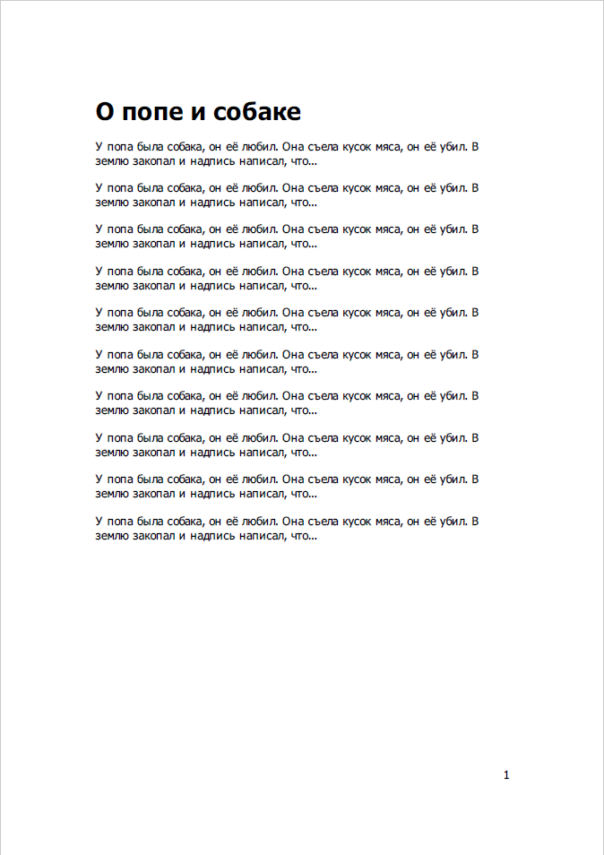

### Вывод PDF средствами Qt

```cpp
#include <QtGui>
#include <QtPrintSupport>
 
int main(int argc, char *argv[])
{
    QApplication app(argc, argv);
 
    QPrinter printer(QPrinter::PrinterResolution);
    printer.setOutputFileName("PriestAndDog.pdf");
    printer.setOutputFormat(QPrinter::PdfFormat);
    printer.setPaperSize(QPrinter::A5);
 
    QTextDocument document;
    QString documentText = "<h1>О попе и собаке</h1>";
    for (int i=0; i < 10; i++) {
        documentText += "<p>У попа была собака, он её любил. ";
        documentText += "Она съела кусок мяса, он её убил. ";
        documentText += "В землю закопал и надпись написал, что...</p>";
    }
    document.setHtml(documentText);
    document.print(&printer);
 
    return 0;
}
```


