### Иерархия проектов в Qt Creator

Сложную разветвленную иерархию проектов в Qt Creator можно организовать при помощи специального проекта "Subdirs". В данном примере я покажу, как создать проект из трёх подпроектов: DLL-библиотеки, тестов и консольного приложения, использующего DLL.

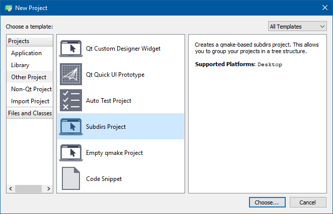

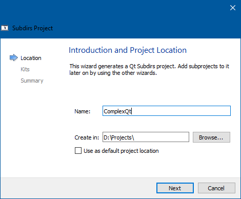

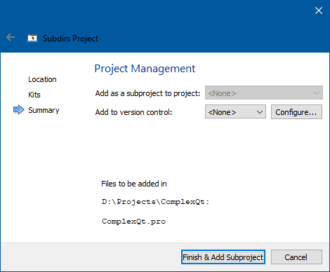

Добавляем субпроект типа "Библиотека":

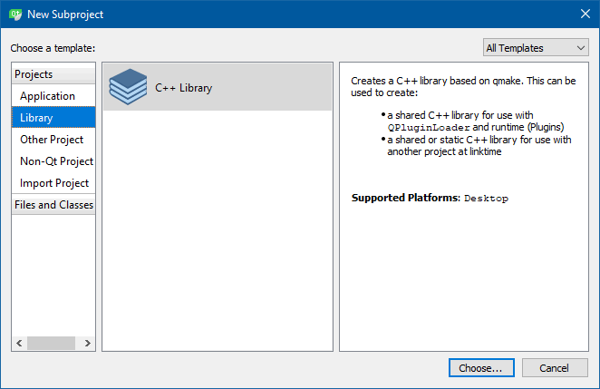

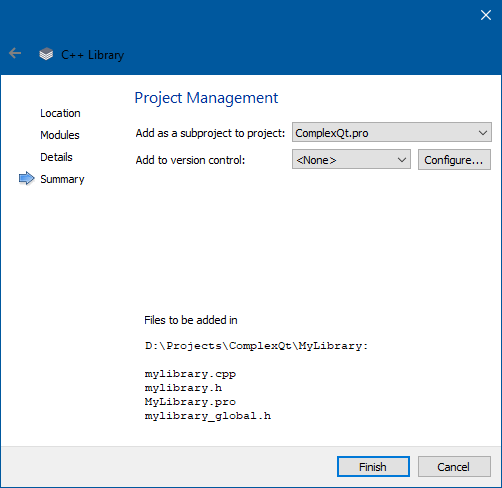

Реализуем простейшую библиотеку из одного класса с двумя статическими методами:

```cpp
// mylibrary.h
#ifndef MYLIBRARY_H
#define MYLIBRARY_H

#include "mylibrary_global.h"

class MYLIBRARYSHARED_EXPORT MyLibrary
{
public:
    static int addition(int first, int second);
    static int substraction(int first, int second);
};

#endif // MYLIBRARY_H
```

```cpp
// mylibrary.cpp
#include "mylibrary.h"

int MyLibrary::addition(int first, int second) {
    return first + second;
}

int MyLibrary::substraction(int first, int second) {
    return first - second;
}
```

Теперь можно добавить приложение, использующее эту библиотеку:

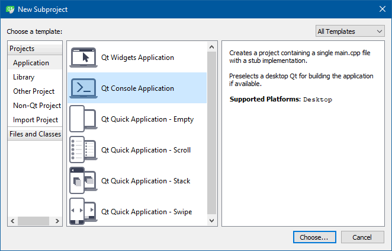

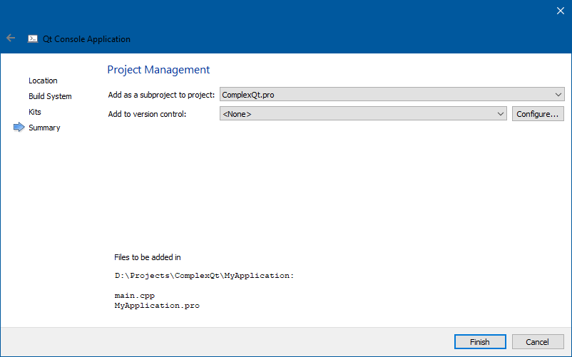

В приложение добавляем ссылку на только что созданную библиотеку:

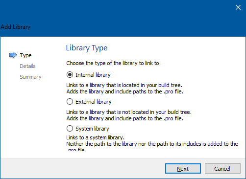

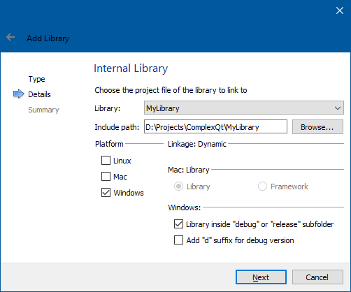

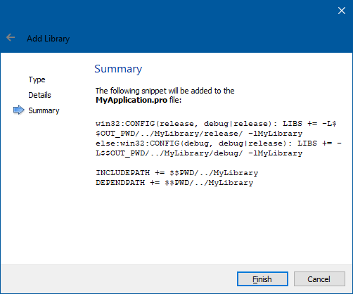

Добавляем в приложение код, использующий библиотеку:

```cpp
#include <QtCore>

#include "mylibrary.h"

int main(int argc, char *argv[])
{
    QCoreApplication a(argc, argv);

    qDebug() << MyLibrary::addition(1, 2);
    qDebug() << MyLibrary::substraction(1, 2);

    return a.exec();
}
```

Собираем проект. Чтобы запустить приложение, вручную копируем DLL в папку с EXE-файлом. Возможно, существует способ автоматизировать это копирование, но я его не нашёл.

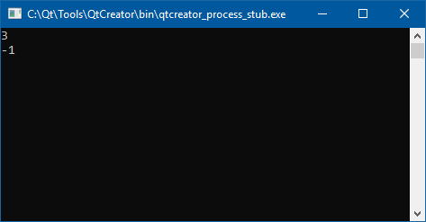

Теперь добавляем отдельный проект для тестов. В нем также создаём ссылку на MyLibrary (точно также как и в EXE-файл).

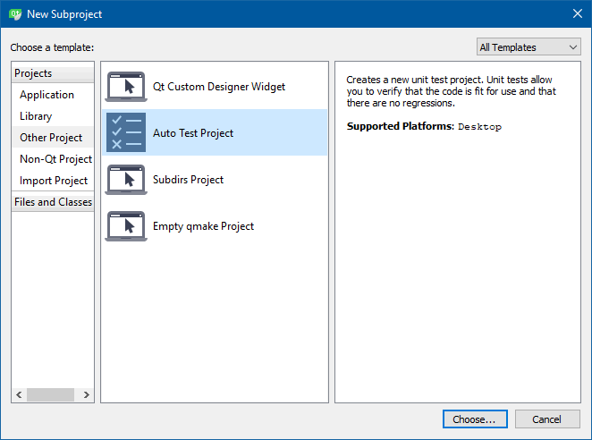

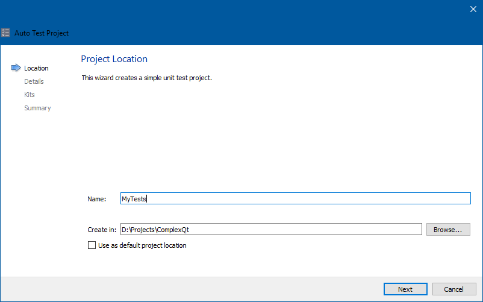

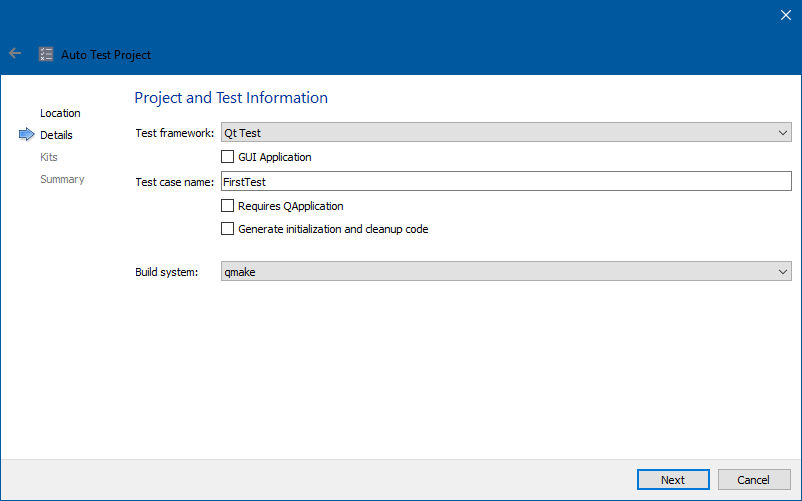

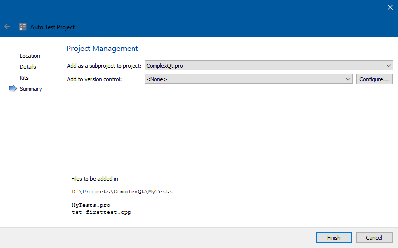

Код тестового проекта:

```cpp
#include <QtCore>
#include <QtTest>

#include "mylibrary.h"

class FirstTest : public QObject
{
    Q_OBJECT

public:
    FirstTest();
    ~FirstTest();

private slots:
    void test_case1();
};

FirstTest::FirstTest() {
}

FirstTest::~FirstTest() {
}

void FirstTest::test_case1() {
    QVERIFY(MyLibrary::addition(1, 2) == 3);
    QVERIFY(MyLibrary::substraction(1, 2) == -1);
}

QTEST_APPLESS_MAIN(FirstTest)

#include "tst_firsttest.moc"
```

Собираем проект (не забываем скопировать вручную DLL в папку с EXE-файлом), запускаем тесты с помощью специального пункта меню:

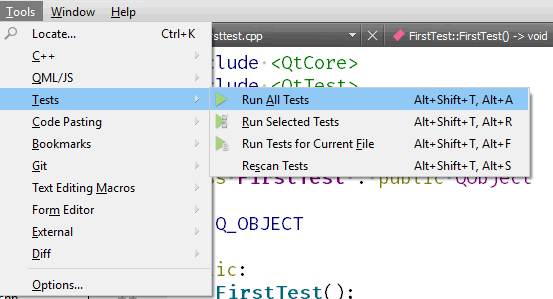

Ура! Все тесты зеленые!

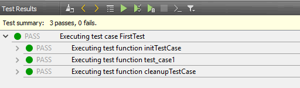

Итого: у нас есть "сводный" проект, который включает в себя три подпроекта: DLL-библиотеку, консольное приложение и набор тестов. Собрать такой проект можно как с помощью Qt Creator, так и с помощью командной строки (не забыть скопировать MyLibrary.dll!):

```
qtvars.cmd
qmake
nmake
copy MyLibrary\release\MyLibrary.dll MyApplication\release\
copy MyLibrary\release\MyLibrary.dll MyTests\release\
```


Как выглядит "главный" pro-файл:

```
TEMPLATE = subdirs

SUBDIRS += \
    MyLibrary \
    MyApplication \
    MyTests
```

Как выглядит pro-файл консольного приложения:

```
QT -= gui

CONFIG += c++11 console
CONFIG -= app_bundle

SOURCES += \
        main.cpp

qnx: target.path = /tmp/$${TARGET}/bin
else: unix:!android: target.path = /opt/$${TARGET}/bin
!isEmpty(target.path): INSTALLS += target

INCLUDEPATH += $$PWD/../MyLibrary
DEPENDPATH += $$PWD/../MyLibrary

win32:CONFIG(release, debug|release): LIBS += -L$$OUT_PWD/../MyLibrary/release/ -lMyLibrary
else:win32:CONFIG(debug, debug|release): LIBS += -L$$OUT_PWD/../MyLibrary/debug/ -lMyLibrary
```

Как выглядит pro-файл тестов:

```
QT += testlib
QT -= gui

CONFIG += qt console warn_on depend_includepath testcase
CONFIG -= app_bundle

TEMPLATE = app

SOURCES +=  tst_firsttest.cpp

win32:CONFIG(release, debug|release): LIBS += -L$$OUT_PWD/../MyLibrary/release/ -lMyLibrary
else:win32:CONFIG(debug, debug|release): LIBS += -L$$OUT_PWD/../MyLibrary/debug/ -lMyLibrary

INCLUDEPATH += $$PWD/../MyLibrary
DEPENDPATH += $$PWD/../MyLibrary
```
