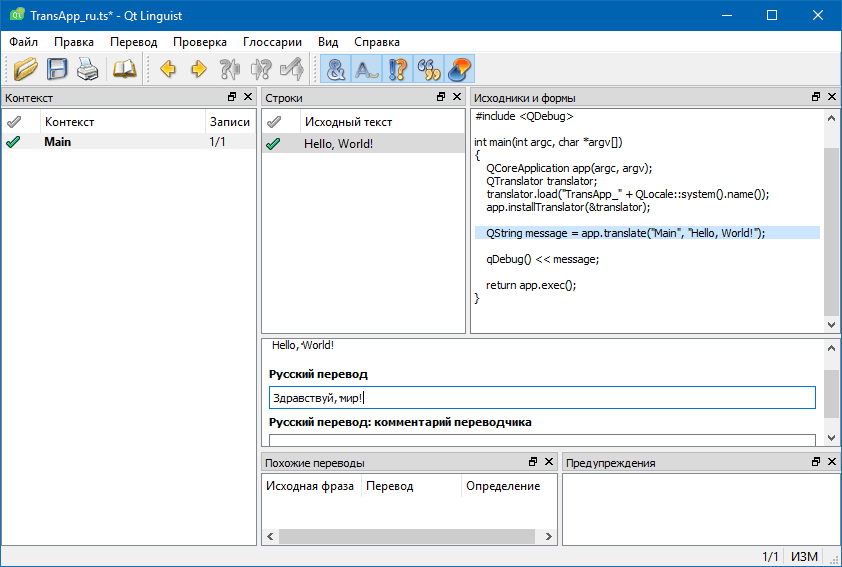

### Перевод приложений

Создаём обычное консольное приложение Qt (для GUI процесс перевода тот же). TransApp.pro:

```
CONFIG += console

SOURCES = TransApp.cpp

TRANSLATIONS = TransApp_ru.ts
```

TransApp.cpp:

```cpp
#include <QCoreApplication>
#include <QTranslator>
#include <QDebug>

int main(int argc, char *argv[])
{
    QCoreApplication app(argc, argv);
    QTranslator translator;
    
    // Загружаем перевод, соответствующий языку системы.
    // В нашем случае это русский (ru).
    translator.load("TransApp_" + QLocale::system().name());
    app.installTranslator(&translator);

    QString message = app.translate("Main", "Hello, World!");

    qDebug() << message;

    return app.exec();
}
```

Обратите внимание на вызов `app.translate`: в нём задаются контекст и подлежащая переводу строка.

Теперь создадим русский перевод для нашего приложения. Для этого сначала заставим Qt выбрать все строки, подлежащие переводу, и поместить их в файл `TransApp_ru.ts`:

```
lupdate -pro TransApp.pro -ts TransApp_ru.ts
```

Для перевода воспользуемся штатным инструментом Linguist:

```
linguist TransApp_ru.ts
```



В Linguist нужно выбрать пункт меню "Файл -> Скомпилировать" или же в командной строке

```
lrelease TransApp.pro
```

Скомпилируем приложение

```
qmake
nmake
windeployqt release\TransApp.exe
copy *.qm release\
```

Если запустить приложение

```
chcp 1251
release\TransApp.exe
```

то оно поприветствует нас

```
"Здравствуй, мир!"
```
